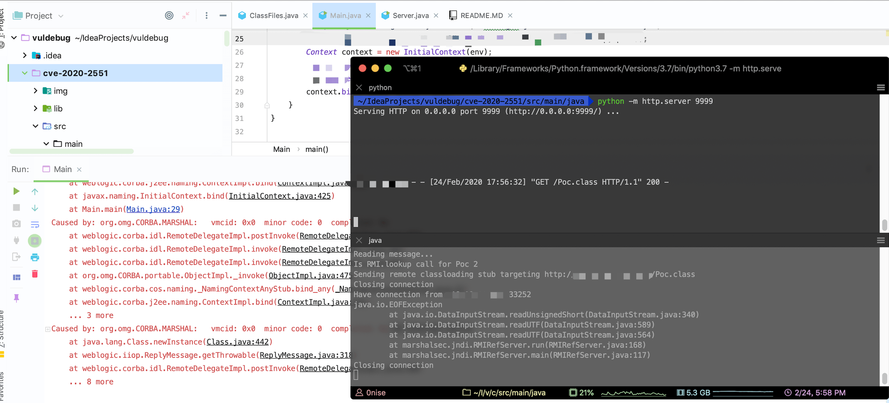

## 描述

在Oracle官方发布的2020年1月关键补丁更新公告CPU（Critical Patch Update）中，公布了一个Weblogic WLS组件IIOP协议中的远程代码执行漏洞（CVE-2020-2551）。

该漏洞可以绕过 Oracle 官方在 2019 年 10 月份发布的最新安全补丁。攻击者可以通过 IIOP 协议远程访问 Weblogic Server 服务器上的远程接口，传入恶意数据，从而获取服务器 权限并在未授权情况下远程执行任意代码。官方给出的CVSS 评分为 9.8。

IIOP 协议以 Java 接口的形式对远程对象进行访问，默认启用。

## 受影响产品

- Oracle WebLogic Server 10.3.6.0.0

- Oracle WebLogic Server 12.1.3.0.0

- Oracle WebLogic Server 12.2.1.3.0

- Oracle WebLogic Server 12.2.1.4.0

## 解决方案

此次 Oracle 官方的 CPU，只发布了12.2.1.4.0 版本的修复补丁， 其他版本补丁将于 2020 年 1 月 31 日发布，请相关用户及时关注，在补丁发布后及时安装修复。

官方通告链接：

https://www.oracle.com/security-alerts/cpujan2020.html

缓解措施：

可通过关闭 IIOP 协议对此漏洞进行缓解。操作如下： 在 Weblogic 控制台中，选择“服务”->”AdminServer”->”协议”，取消“启用 IIOP”的勾选。 并重启 Weblogic 项目，使配置生效。

## 利用说明

**该漏洞影响及其广泛，建议立即修复。相关的利用POC以及EXP本仓库不出意外是不会放出来了。**

POC 编译版本最好使用JDK1.6版本，受影响产品中 `10.3.6.0.0` 默认自带 `jdk 1.6` 版本，如高于此版本执行失败。

建议编译POC时环境的命令为，来进行指定编译结果版本：

```
javac Poc.java -source 1.6 -target 1.6
```

## 分析文章

在线：[漫谈WebLogic CVE-2020-2551](https://www.r4v3zn.com/posts/b64d9185/)

pdf：[漫谈WebLogic-CVE-2020-2551.pdf](./漫谈WebLogic-CVE-2020-2551.pdf)

### 利用截图



### 成功截图


## 鸣谢

[@CHYbeta](https://github.com/CHYbeta)

[@kuron3k0](https://github.com/kuron3k0)

感谢俩位师傅在复现的指导。

## 参考

- [【威胁通告】Weblogic WLS组件IIOP协议远程代码执行漏洞（CVE-2020-2551）
](http://blog.nsfocus.net/cve-2020-2551/)

- [Weblogic IIOP反序列化漏洞（CVE-2020-2551） 漏洞分析
](https://www.anquanke.com/post/id/197605)


